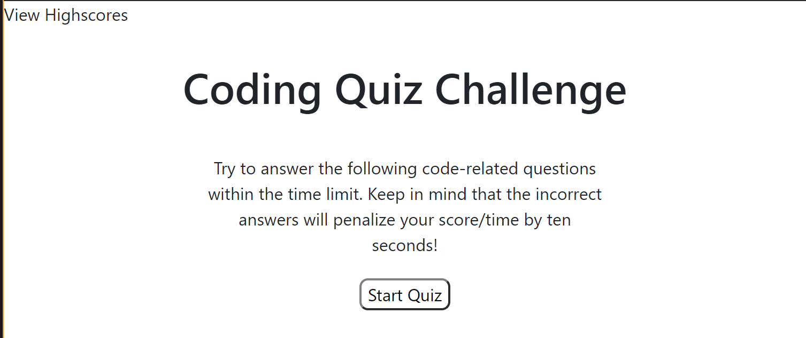
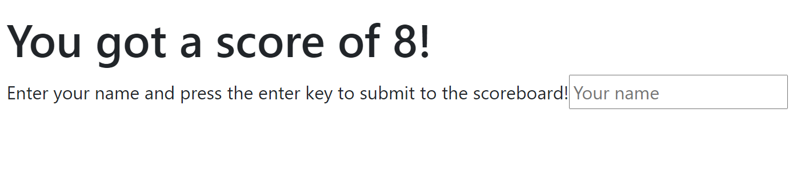

# BCS HW 4: Password Generator

An HTML site that utilizes JavaScript to run a quiz.

## Access to the HTML

The active URL for this documant is as follows:

https://clydebaron2000.github.io/BCShw4/

Click the link to view the full project via Github Pages.

## Project Preview

## Author

* **Clyde Baron Rapinan** -*Initial work*- https://github.com/clydebaron2000

## Acknowledgments

* UCSD Full Stack Bootcamp for the assignment

## License

[GNU](https://choosealicense.com/licenses/gpl-3.0/)
